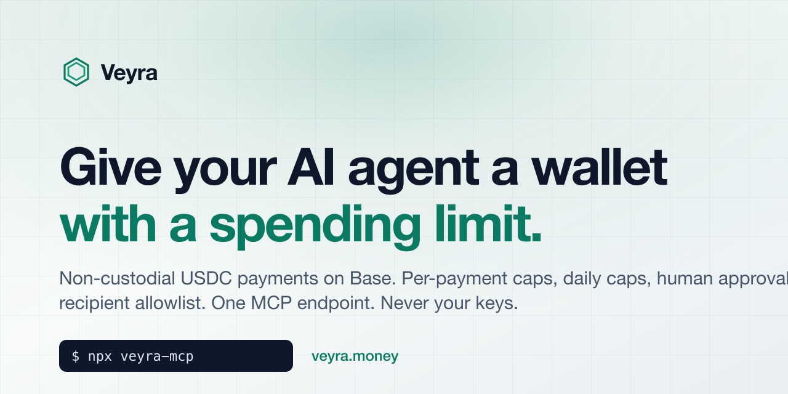

<p align="center">
  <a href="https://veyra.money"></a>
</p>

<h1 align="center">veyra-mcp</h1>

<p align="center">
  <b>Give your AI agent a wallet with a spending limit.</b><br>
  MCP server + typed client for <a href="https://veyra.money">Veyra</a>: non-custodial USDC payments on Base, with per-payment caps, daily caps, human approval bands and a recipient allowlist — all enforced server-side, never by the model.
</p>

<p align="center">
  <a href="https://www.npmjs.com/package/veyra-mcp"></a>
  <a href="https://github.com/iykemoney92/veyra-mcp/actions/workflows/ci.yml"></a>
  <a href="LICENSE"></a>
  <a href="https://veyra.money/docs"></a>
</p>

---

## The problem

Agents increasingly need to pay for things: an API call, a dataset, a bounty, another agent. Today the choices are bad:

- **Hand the agent a private key.** One prompt injection away from an empty wallet.
- **Hand it a card.** No per-call limits, no allowlist, and your bank will not tell you which tool call spent the money.
- **Approve every payment by hand.** Then it is not really an agent.

Veyra is the layer in between. You connect a wallet you already own, set what an agent may spend, and hand the agent one MCP endpoint. The agent gets tools like `create_payment`. It never sees a key, and it cannot exceed the limits you set because the limits are enforced by Veyra's server, not by the model following instructions.

```
  agent  ──MCP──▶  veyra.money  ──policy──▶  your wallet  ──USDC on Base──▶  recipient
                    │
                    ├─ under auto-max      → executes from your capped on-chain allowance
                    ├─ in the ask band     → you approve in your own wallet (one link)
                    └─ over the limits     → blocked, agent is told why
```

## 60-second setup

1. Sign up at [veyra.money](https://veyra.money), connect a wallet (or start with the **simulated** source, which moves no money).
2. Create an MCP endpoint with limits. Copy the credential (it starts with `veyra_`).
3. Add it to your host:

<details open>
<summary><b>Claude Code</b></summary>

```bash
claude mcp add --transport http veyra https://veyra.money/api/mcp \
  --header "Authorization: Bearer veyra_..."
```
</details>

<details>
<summary><b>Cursor</b> (<code>.cursor/mcp.json</code>)</summary>

```json
{
  "mcpServers": {
    "veyra": {
      "url": "https://veyra.money/api/mcp",
      "headers": { "Authorization": "Bearer veyra_..." }
    }
  }
}
```
</details>

<details>
<summary><b>OpenAI Codex</b></summary>

```bash
export VEYRA_TOKEN=veyra_...
codex mcp add veyra --url https://veyra.money/api/mcp --bearer-token-env-var VEYRA_TOKEN
```
</details>

<details>
<summary><b>Claude Desktop</b> and any host that cannot send a bearer header (<code>claude_desktop_config.json</code>)</summary>

```json
{
  "mcpServers": {
    "veyra": {
      "command": "npx",
      "args": ["-y", "veyra-mcp"],
      "env": { "VEYRA_TOKEN": "veyra_..." }
    }
  }
}
```

The `veyra-mcp` binary is a stdio bridge: it holds the credential locally and relays every call to the hosted endpoint. No policy lives in the bridge.
</details>

<details>
<summary><b>Anything else</b> (plain JSON-RPC)</summary>

```bash
curl -s https://veyra.money/api/mcp \
  -H "Authorization: Bearer veyra_..." \
  -H "Content-Type: application/json" \
  -d '{"jsonrpc":"2.0","id":1,"method":"tools/call","params":{"name":"get_budget","arguments":{}}}'
```
</details>

Then ask the agent to do something that costs money and watch the policy decide.

## Tools the agent gets

| Tool | What it does |
|---|---|
| `get_capabilities` | Rails, networks, assets, limits and the recipient allowlist in force right now |
| `get_budget` | Daily limit, spent today, per-payment limit, auto and ask bands |
| `list_payment_sources` | Masked sources and whether each can settle without a human |
| `create_payment` | Create a payment intent. Policy is applied server-side and the result says what happened |
| `get_payment` | Canonical state for one payment, including which rail settled it |
| `list_payments` | Recent payments for this endpoint |
| `cancel_payment` | Cancel while still cancellable |

Every payment reports one of these statuses:

| Status | Meaning |
|---|---|
| `confirmed` | Value moved on-chain |
| `confirmed_simulated` | Settled on the simulated rail. **No money moved.** The agent is told this explicitly |
| `awaiting_approval` | In the ask band. `next_action.url` is a one-time link the owner opens in their own wallet |
| `submitted` | Transaction sent, waiting for the chain receipt |
| `pending` | Created, not yet evaluated or executed |
| `failed` / `cancelled` / `expired` | Terminal. Blocked-by-policy payments are `failed` with a `policy_reason` |

## Use it from code

```bash
npm install veyra-mcp
```

```ts
import { VeyraClient, VeyraToolError, idempotencyKey } from "veyra-mcp";

const veyra = new VeyraClient({ token: process.env.VEYRA_TOKEN! });

const budget = await veyra.getBudget();
console.log(`spent ${budget.spent_today} of ${budget.daily_limit} USDC today`);

try {
  const payment = await veyra.createPayment({
    amount: "1.25",
    recipient: "0x1234…abcd",          // USDC on Base
    reason: "Weather API, 500 calls",
    idempotency_key: idempotencyKey("weather"),
  });

  if (payment.status === "awaiting_approval") {
    console.log("Owner needs to approve:", payment.next_action?.url);
    const settled = await veyra.waitForPayment(payment.payment_id);
    console.log(settled.status);
  }
} catch (e) {
  if (e instanceof VeyraToolError) {
    // A deliberate refusal: policy, validation, allowlist, auth.
    console.log(e.code, e.message);   // e.g. "POLICY_BLOCKED …"
  } else throw e;
}
```

`VEYRA_TOOLS` exports the tool definitions as JSON Schema, so you can register them with the Vercel AI SDK, LangChain, or plain function calling without a network round-trip. See [veyra-examples](https://github.com/iykemoney92/veyra-examples) for complete agents built with the Claude Agent SDK and the Vercel AI SDK.

## What you are trusting

Worth being blunt, because this is money.

- **Veyra never holds your funds.** Payments go from your wallet to the recipient. There is no Veyra balance in the middle.
- **Above your auto-approve limit** nothing is delegated. You sign each transfer in your own wallet from the approval link. Veyra verifies the on-chain receipt matches the request.
- **Within your auto-approve limit** you grant a capped ERC-20 allowance to a relayer Veyra operates, the same `approve` primitive every DeFi app uses. The token contract enforces the cap. Veyra's policy engine decides the destination within that cap, so size the allowance like a float you could lose, and use the recipient allowlist when you know who the agent should be paying. Revoke it any time.
- **The simulated rail** exists so you can wire everything up before touching real funds. It is labelled everywhere: status `confirmed_simulated`, `simulated: true`.
- **Every decision is in the audit log**, including limit changes and credential rotations.

Full details: [How a payment actually moves](https://veyra.money/docs#how-it-moves) and [What you are trusting, exactly](https://veyra.money/docs#trust).

## FAQ

**Which networks and assets?** USDC on Base. One stablecoin keeps the dollar limits exact without a price feed, and Base is where the agent-payment ecosystem already settles. More rails are on the roadmap; open an issue if you need one.

**Does this work with x402 or pay-per-call APIs?** Yes, in the sense that matters: the agent asks Veyra to pay the seller's address and gets a receipt. Veyra is the spending policy, not the protocol on the other end.

**Can I self-host?** Not today. This repo is the client and bridge; the policy engine is the hosted service at veyra.money. The wallet-approval path is fully non-custodial regardless.

**What does it cost?** There is a free plan. See [pricing](https://veyra.money/pricing).

**Where do I report a bad policy decision?** From the dashboard, so support can see your audit log. This repo's issues are for the client and bridge.

## Development

```bash
npm install
npm test     # builds, then runs the suite against a local mock of the endpoint
```

See [CONTRIBUTING.md](CONTRIBUTING.md) and [SECURITY.md](SECURITY.md).

## Links

- Product: [veyra.money](https://veyra.money) · [Docs](https://veyra.money/docs) · [Pricing](https://veyra.money/pricing)
- Examples: [iykemoney92/veyra-examples](https://github.com/iykemoney92/veyra-examples)
- MCP Registry name: `io.github.iykemoney92/veyra`

MIT © Veyra
